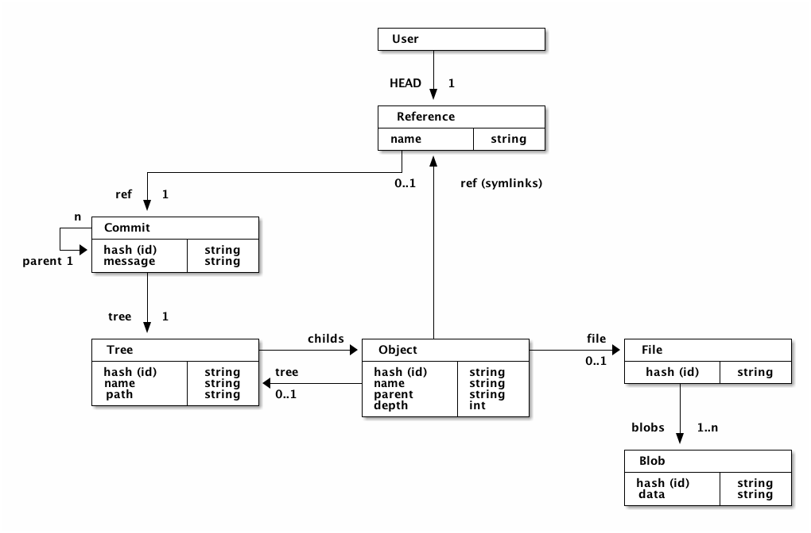

# Distributed Storage

This library provides a storage solution. This solution provides interfaces to stores a directory structures for each
user. Basically it stores file as blob objects in a database which is replaceable by adapters.

The used data-model is inspired by the data-model of git.

