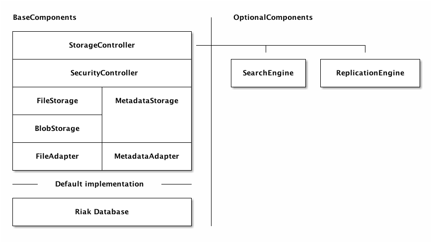

# Distributed Storage

This library provides a storage solution. This solution provides interfaces to stores a directory structures for each
user. Basically it stores file as blob objects in a database which is replaceable by adapters.

The used data-model is inspired by the data-model of git. See information about the 
[data-model here ...](https://github.com/symcloud/distributed-storage/blob/master/doc/data-model.md)

## Features

* [File Versioning](https://github.com/symcloud/distributed-storage/blob/master/doc/versioning.md): enables get/restore
 old versions of files and trees
* [File Metadata](https://github.com/symcloud/distributed-storage/blob/master/doc/metadata.md): enables to store
 unstructured data to describe images and links between files.
* [Symlinks](https://github.com/symcloud/distributed-storage/blob/master/doc/symlinks.md): enables links to folder and
 directories inside an other directory tree
* [ACL](https://github.com/symcloud/distributed-storage/blob/master/doc/acl.md): enables security layer for files and
 directories based on a external user provider
* [Local cache](https://github.com/symcloud/distributed-storage/blob/master/doc/cache.md): enables local cache for each
 user to extend speed of response

## Architecture

The architecture of the library is layer-based which can be replaced for your use. 

### Adapter

To store the information and data of the files this library uses adapter to decouple the library from a database. The 
Default implementation is build ontop of the open-source distributed database [riak](http://basho.com/riak/) and uses
the [riak-php-client](https://github.com/basho/riak-php-client) to communicate to the database. More information about
[adapter here ...](https://github.com/symcloud/distributed-storage/blob/master/doc/adapter.md)
